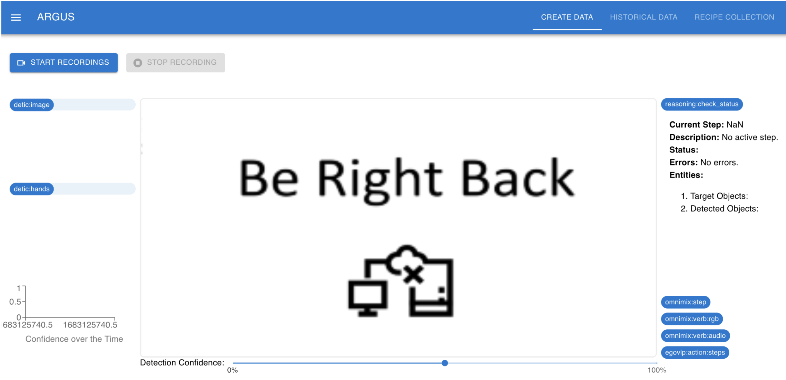
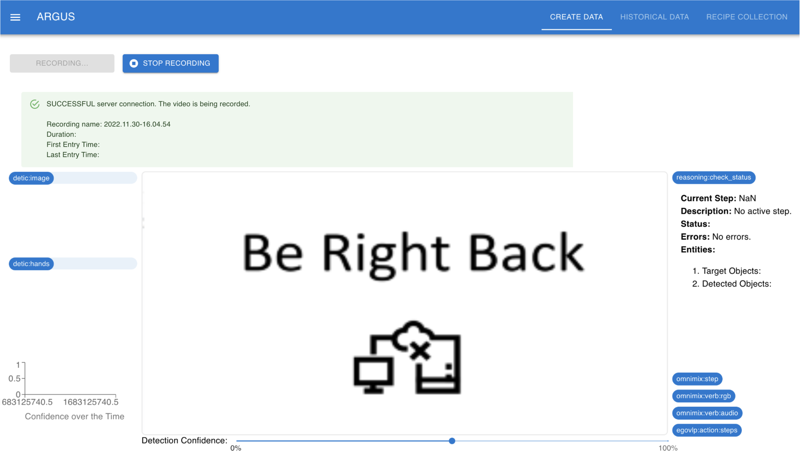
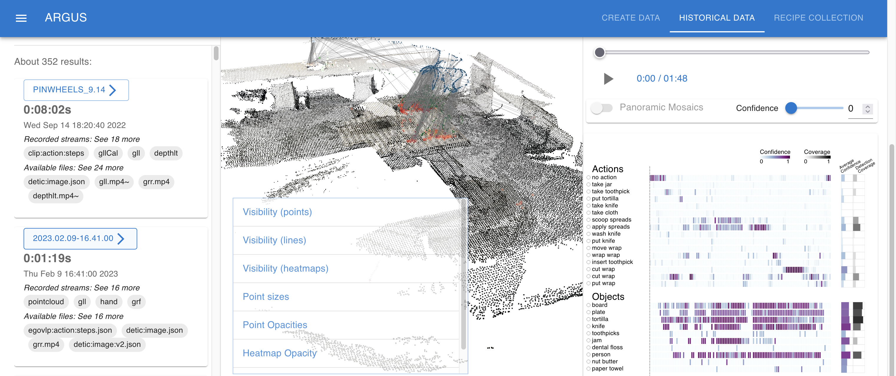
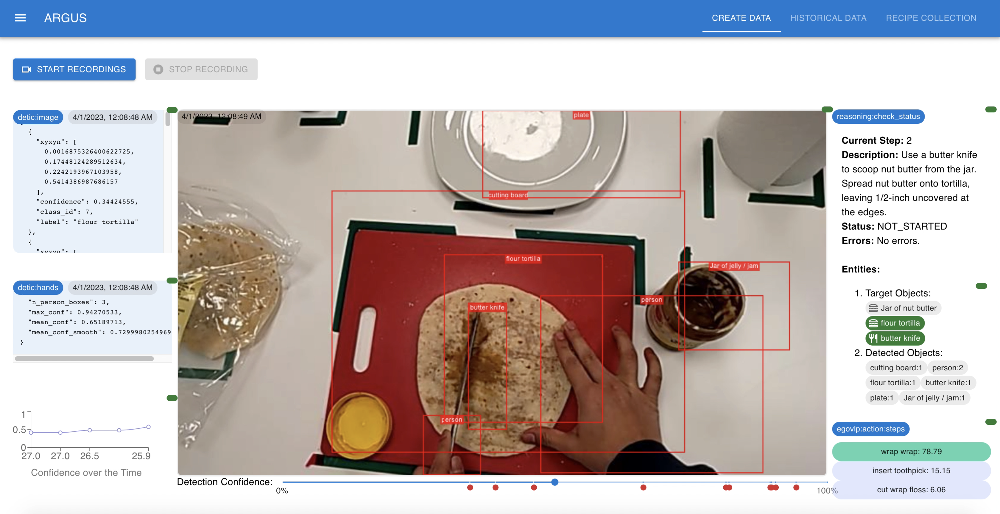
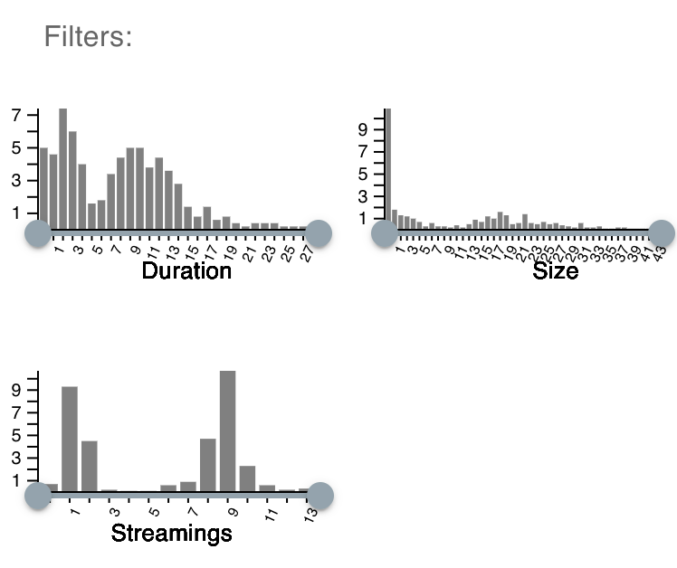
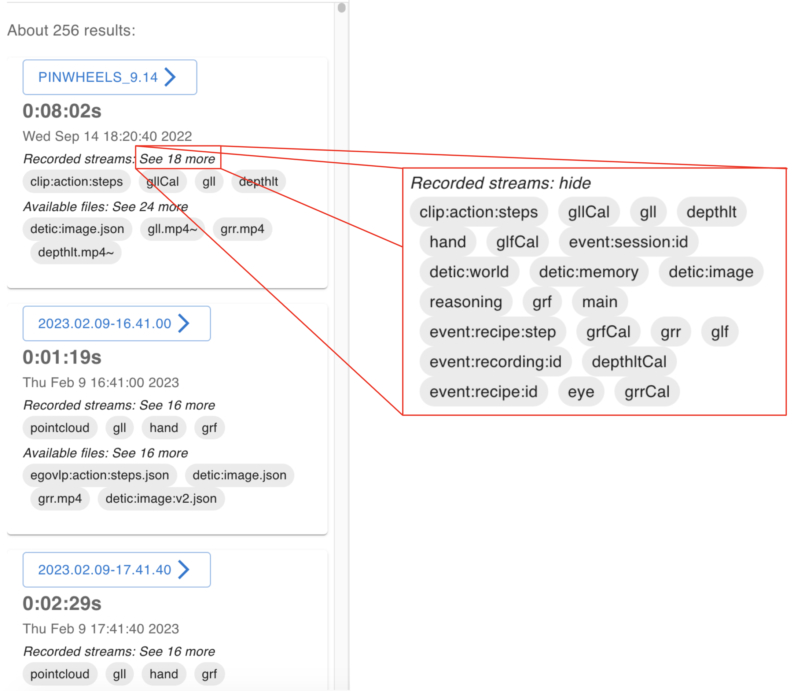
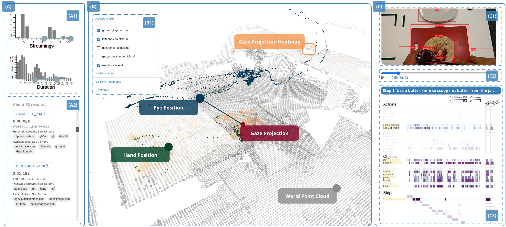
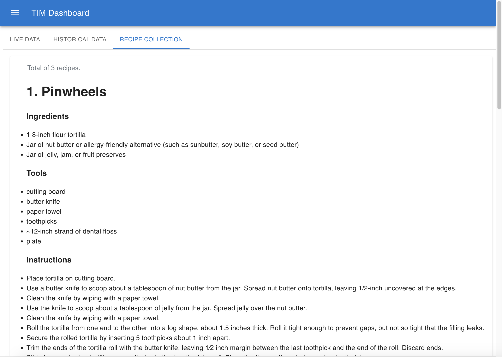

Using the web interface
=======================

ARGUS is an interactive webpage to view current streams, access historical data, and debug models. 
The web interface allows users to explore the Hololens data with no additional software. 

The system can be found at this address: http://dashboardptg.vida-nyu.org:8033/

ARGUS has two operation modes: “Online” (during task performance), and “Offline” (after performance). ARGUS has four main features:  (1) Data creation , (2) data exploration, (3) model debugging, and (4) recipe collection (ingredients, descriptions, tools, etc).

Online Mode
----------------------

Under the tab “Create Data”, users can create new data and perform a real-time debugging. 

**Data Creation**

This page allows users to record new videos using a hololens. If the hololens is connected, you will see the live view. Otherwise, displays the following message: "Be right back". \ 

To start a new recording, click on the "Start Recording" button. 

When you are done, click on the "Stop Recording" buttton to stop and finish the recording. Automatically, the video will be saved and uploaded to the server under a unique and pre-generated name with date and time stamps of the current system (YY-MM-DD.HH-MM-SS). 

To verify if the recording was saved correctly, go to the tab "Historical Data", then click on the last entry from the list of recording listed in the left-side. It may take some time to appear here (around 1 min).

**Real-Time Model Debugging**

Under the tab “Create Data”, users can perform a real-time debugging. This page allows users inspect the model’s outputs. To better follow the interpretation systems during a stream, the debugging model tab provides model outputs from recognition, reasoning, and perception modules. Included are the following:

1. In the center of the interface, we draw bounding boxes around the objects in the video to identify the spatial location. Labels are also displayed. Users can also change the detection confidence to inspect how this impacts the model performance. \
2. In the upper-right, the interpreted current step, a description of that step, the user’s status within the step, and any errors detected.\
3. Below (2) are the objects needed in the current step (“target objects”) and the currently detected objects.
4. Below (3), is the list of predicted most likely current actions with their probability. In this example, the model predicts with 78.79% likelihood “wrap wrap” is the current action, followed by “insert toothpick” at 15.15%.
5. In the upper-left, we display the location and confidence for the recognized objects and user hands as well as a small graph of the hand detection confidence over time.

“Offline” Mode
----------------------

Under the tab “Historical Data”, ARGUS provides a visual user interface that enables querying, filtering, and exploration of the data. Due to the spatiotemporal characteristics of the data, we provide both spatial and temporal visualization widgets to allow users to analyze the data from different perspectives. 

ARGUS offline mode has 3 main components: the Data Manager, the Temporal View, and the Spatial View.

.. This page allows you to inspect all the recordings. By default, the data that belongs to the first recording is displayed. To select a different recording, use the "Select Data" drop-down menu. 
.. Currently, the following data is displayed: Cameras (Main, Depth, Grey Left-Left, Grey Left-Front, Grey Right-Front, and Grey Right-Right), Eye data and inertial measurement unit (IMU) data.\

**Data Manager**
The Data Manager enables data retrieval by allowing users to specify filters and select specific sessions from a list of results.
Users can query the data by specifying various filters. Filters are presented in the form of histograms the users can brush to select the desired range. 

The results component displays the retrieved sessions in a list format. The following figure shows the results for a given query specified by the user. Each element represents a session showing key features,
including name, duration, date, recorded streams, and available model outputs. Once an element of the list is clicked, all the corresponding
data will be loaded into the views of the system.

**Spatial View**
ARGUS provides a Spatial View that allows users to analyze how performers interact with the physical environment in conjunction with the spatial distribution of model outputs. 

**Temporal View**
ARGUS provides a model debugger based on temporal visualizations to debug the ML models used in AI assistant systems.

Using the controls, users can play/stop all the videos. They can also seek any position on the video using the slider. 

.. At the upper-right of the previous image, the eye data is displayed. Find below an expanded version of it. It is a visualization of the LIDAR mosaic of the physical space with user location over time denoted by beige squares and user vision path by blue lines.

.. Finally, at the bottom is the IMU metrics over time of head/HoloLens acceleration, rotation (gyroscope), and velocity in the x (blue), y (orange), and z (green) directions.

**Recipe Collection**

This page allows users to explore the recipes. It includes information about the ingredients, tools and descriptions.

