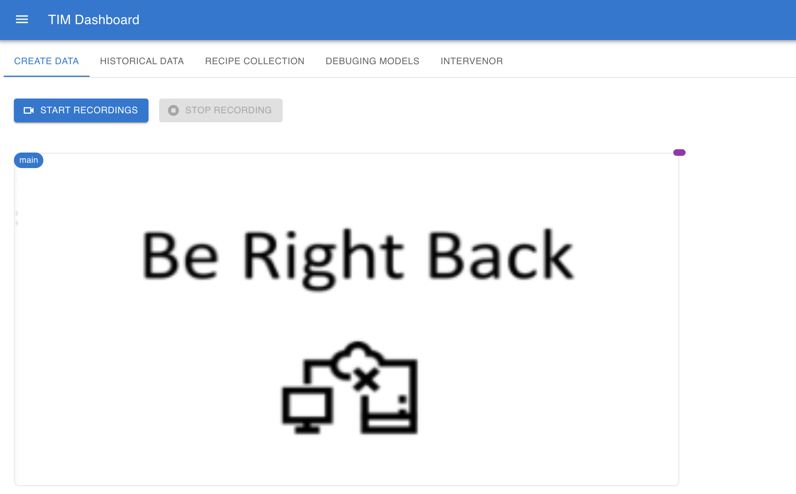

Using the web interface
=======================

The Dashboard is an interactive webpage to view current streams, access historical data, debug, and view the human-in-the-loop tool (Intervenor). 
The web interface allows users to explore the Hololens data with no additional software. 

The version of TIM-Dashboard that we host can be accessed at https://dashboard.ptg.poly.edu/

The Dashboard has five main features:  (1) Data creation , (2) data exploration, (3)  recipe collection (ingredients, descriptions, tools, etc), (4) model debugging and (5) the Intervenor.

Data creation 
----------------------

This page allows users to record new videos using a hololens. If the hololens is connected, you will see the live view. Otherwise, displays the following message: "Be right back". \ 

To start a new recording, click on the "Start Recording" button. 

When you are done, click on the "Stop Recording" buttton to stop and finish the recording. Automatically, the video will be saved and uploaded to the server under a unique and pre-generated name with date and time stamps of the current system (YY-MM-DD.HH-MM-SS). 

..  figure:: screenshots/stop_rec_v2.png

To verify if the recording was saved correctly, go to the tab "Historical Data", then click on the last entry from the "Select Data" drop-down. It may take some time to appear here (around 1 min).

..  figure:: screenshots/check_rec.png

Historical Data
----------------

This page allows you to inspect all the recordings. By default, the data that belongs to the first recording is displayed. To select a different recording, use the "Select Data" drop-down menu. 
Currently, the following data is displayed: Cameras (Main, Depth, Grey Left-Left, Grey Left-Front, Grey Right-Front, and Grey Right-Right), Eye data and inertial measurement unit (IMU) data.\

Using the controls, users can play/stop all the videos. They can also seek any position on the video using the slider. 

..  figure:: screenshots/historical_data_view.png

At the upper-right of the previous image, the eye data is displayed. Find below an expanded version of it. It is a visualization of the LIDAR mosaic of the physical space with user location over time denoted by beige squares and user vision path by blue lines.

..  figure:: screenshots/eye_data_vis.png

Finally, at the bottom is the IMU metrics over time of head/HoloLens acceleration, rotation (gyroscope), and velocity in the x (blue), y (orange), and z (green) directions.

Recipe Collection
-----------------

This page allows users to explore the recipes. It includes information about the ingredients, tools and descriptions.

..  figure:: screenshots/recipes_tab.png

Debugging Models
-----------------

This page allows users inspect the model’s outputs. To better follow the interpretation systems during a stream, the debugging model tab provides model outputs from recognition, reasoning, and perception modules. Included are the following:

1. In the upper-left, we draw bounding boxes around the objects in the video to identify the spatial location. Labels are also displayed. Users can also change the detection confidence to inspect how this impacts the model performance. \

2. In the upper-right, the interpreted current step, a description of that step, the user’s status within the step, and any errors detected.\
3. Below (2) are the objects needed in the current step (“target objects”) and the currently detected objects.
4. Below (3), is the list of predicted most likely current actions with their probability. In this example, the model predicts with 70.64% likelihood “apply spreads” is the current action, followed by “scoop spreads” at 14.68%.
5. The bottom row displays the location and confidence for the recognized objects and user hands as well as a small graph of the hand detection confidence over time.

Intervenor
----------------

Intervenor was designed to loop an intervening user in the model inference and user operation. The intervenor is likely to be a model developer, system administrator, or other person who wants to control the TIM system. The system supports two major goals:

1. The first is to allow the intervenor to directly intervene in the experiments. The idea is motivated by the fact that the reasoning/perceptual modules are imperfect so the human should be looped into the process. The intervenor user can directly control the reasoning step through the step control view. 
2. The second aim is to enable a deeper dive into the model behavior. The intervenor user can inspect the model behavior through reasoning and temporal views allowing human interaction in the loop.

Intervenor supports two modes, i.e., online and offline. The online mode allows the intervenor to control the TIM interface currently being streamed. The offline mode enables the intervenor to replay a recording, while inspecting the model behaviors in the model. The offline mode can help the developer to understand and improve the model. The intervenor can fix incorrect predictions and annotate the recording for future analysis. To support the two modes, the following components exist:

